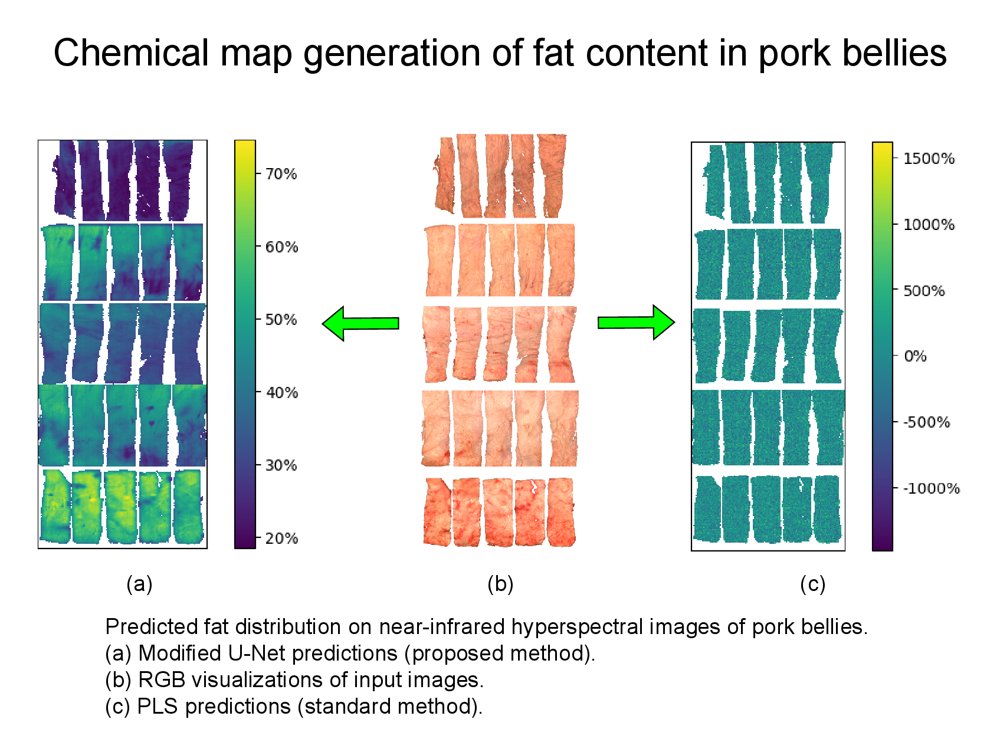

# PorkBellyHSI

This repository contains source code showing the model architecture, loss function, and training pipeline used by Engstrøm et al. [[1]](#references) to generate chemical maps of pork bellies with a modified U-Net [[2]](#references). Executing [train_unet_chemmap.py](train_unet_chemmap.py) will train, validate, and evaluate the modified U-Net under the five-fold cross-validation scheme explained by Engstrøm et al. [[1]](#references). Note that this script is only for documentation purposes, as actual training requires access to the dataset by Albano-Gaglio et al. [[3]](#references).

If you want a U-Net implementation, [this repository](https://github.com/sm00thix/unet) releases a U-Net implementation under the permissive Apache 2.0 License.

The weights for the ensemble of five modified U-Nets used by Engstrøm et al. [[1]](#references) is available on [Hugging Face](https://huggingface.co/Sm00thix/unet_chemical_map).

## References
1. [O.-C. G. Engstrøm, M. Albano-Gaglio, E. S. Dreier, Y. Bouzembrak, M. Font-i-Furnols, P. Mishra, and K. S. Pedersen (2025). Transforming Hyperspectral Images Into Chemical Maps: An End-to-End Deep Learning Approach](https://arxiv.org/abs/2504.14131)

2. [O. Ronneberger, P. Fischer, and Thomas Brox (2015). U-Net: Convolutional Networks for Biomedical Image Segmentation. *MICCAI 2015*.](https://arxiv.org/abs/1505.04597)

3. [M. Albano-Gaglio, P. Mishra, S. W. Erasmus, J. F. Tejeda, A. Brun, B. Marcos, C. Zomeño, and M. Font-i-Furnols (2025). Visible and near-infrared spectral imaging combined with robust regression for predicting firmness, fatness, and compositional properties of fresh pork bellies *Meat Science*.](https://doi.org/10.1016/j.meatsci.2024.109645)

## Funding
This work has been carried out as part of an industrial Ph.D. project receiving funding from [FOSS Analytical A/S](https://www.fossanalytics.com/) and [The Innovation Fund Denmark](https://innovationsfonden.dk/en). Grant number 1044-00108B.